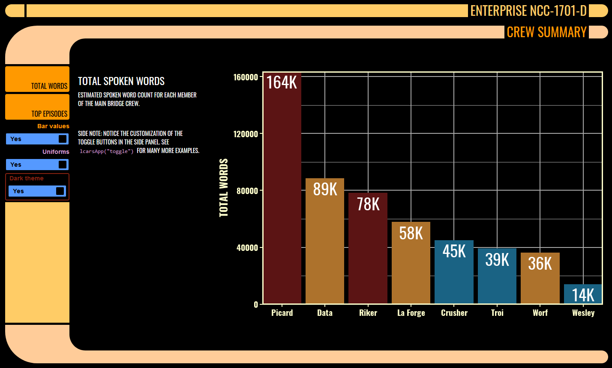

<!-- README.md is generated from README.Rmd. Please edit that file -->

# lcars 

**Author:** [Matthew Leonawicz](https://leonawicz.github.io/blog/)
<a href="https://orcid.org/0000-0001-9452-2771" target="orcid.widget">
<image class="orcid" src="https://members.orcid.org/sites/default/files/vector_iD_icon.svg" height="16"></a>
<br/> **License:** [MIT](https://opensource.org/licenses/MIT)<br/>

[](https://cran.r-project.org/package=lcars)
[](https://cran.r-project.org/package=lcars)
[](http://www.rdocumentation.org/packages/lcars)
[](https://travis-ci.org/leonawicz/lcars)
[](https://ci.appveyor.com/project/leonawicz/lcars)
[](https://codecov.io/gh/leonawicz/lcars?branch=master)

## Library Computer Access/Retrieval System ([LCARS](https://en.wikipedia.org/wiki/LCARS))

The `lcars` package provides simple approximations to LCARS style and
appearance to give static plots and interactive data analysis an LCARS
theme. This splits the package into two areas:

  - One key feature in `lcars` is the ability to wrap ggplot objects in
    an LCARS-themed border using `lcars_border`.
  - There is also support for an LCARS-themed Shiny UI using `lcarsPage`
    and related functions.

While the former is fun and useful for static graphs, the latter is much
more exciting because it means you can make something with the look and
feel of LCARS that also *actually functions*\!



That’s right. Make your Shiny app, view it on a touch screen device like
your very own Federation issue data PADD, and transport yourself into
the future of the Star Trek universe with this 1980s sci-fi television
aesthetic\!

The static plot border and Shiny `lcarsBox` widget both give plenty of
control over the style. Given their different fundamental designs, they
provide somewhat different aspects of design control via their
respective function arguments.

## Installation

You can install the released version of `lcars` from
[CRAN](https://CRAN.R-project.org) with:

``` r
install.packages("lcars")
```

You can install the development version of `lcars` from GitHub with:

``` r
# install.packages("remotes")
remotes::install_github("leonawicz/lcars")
```

## Example

``` r
library(lcars)
library(ggplot2)

g <- ggplot(iris, aes(Sepal.Length, Sepal.Width, color = Species)) + 
  geom_point() + facet_wrap(~Species, 2) + theme_lcars_light()

len_frac <- c(0.3, 0.5, 0.2, 0.4, 0.3, 0.2, 0.1, 0.3)
n_seg <- c(1, 2, 0, 8)
lcars_border(g, corners = 1:3, length_frac = len_frac, side_n_segments = n_seg)
```


For more examples see the [introduction](articles/lcars.html) vignette.
